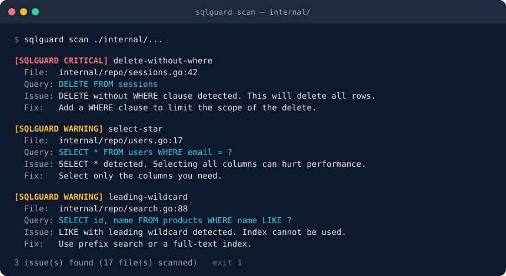

<!-- The centred logo block opens the file, so there is no h1 on line 1. -->
<!-- markdownlint-disable-next-line MD041 -->
<p align="center">
  <picture>
    <source media="(prefers-color-scheme: dark)" srcset="website/static/img/logo-dark.svg">
    
  </picture>
</p>

<h1 align="center">sqlguard</h1>

<p align="center">
  Production-safe SQL query analyzer for Go. Catches <code>SELECT *</code>,
  missing <code>WHERE</code> clauses, N+1 loops and slow queries — at runtime
  through a <code>database/sql</code> driver wrapper, statically in CI, or
  from the query plan.
</p>

<p align="center">
  <a href="https://pkg.go.dev/github.com/KARTIKrocks/sqlguard"></a>
  <a href="https://github.com/KARTIKrocks/sqlguard/releases"></a>
  <a href="go.mod"></a>
  <a href="https://github.com/KARTIKrocks/sqlguard/actions/workflows/ci.yml"></a>
  <a href="https://github.com/KARTIKrocks/sqlguard/actions/workflows/codeql.yml"></a>
  <a href="https://codecov.io/gh/KARTIKrocks/sqlguard"></a>
  <a href="https://goreportcard.com/report/github.com/KARTIKrocks/sqlguard"></a>
  <a href="LICENSE"></a>
</p>

<p align="center">
  <b><a href="https://kartikrocks.github.io/sqlguard/">Documentation</a></b> ·
  <b><a href="https://pkg.go.dev/github.com/KARTIKrocks/sqlguard">API Reference</a></b> ·
  <b><a href="CHANGELOG.md">Changelog</a></b>
</p>

<p align="center">
  
</p>

<p align="center">
  <code>sqlguard scan ./...</code> — the same rules the runtime middleware applies to every query your app sends.
</p>

## Why sqlguard?

Query logging tells you what ran. It does not tell you that the query was a
full-table `DELETE`, that the same lookup just ran 400 times in a loop, or
that a `LIKE '%…'` can never use the index. sqlguard sits at the one place
every query passes through — the `database/sql` driver — and turns those
into findings with a rule name, a redacted query and a fix:

| Capability | sqlguard | Hand-rolled query logging |
| - | - | - |
| Every query analyzed, ORM or raw, no wrapper type to thread through | ✓ | You build it |
| 21 SQL anti-pattern rules with tunable severities | ✓ | You build it |
| N+1 and slow-query detection at the driver | ✓ | You build it |
| Literal redaction + stable, PII-free fingerprints | ✓ | You build it |
| De-duplication and a per-query analysis cache | ✓ | You build it |
| Static scan of Go source for CI (`exit 1` on findings) | ✓ | You build it |
| EXPLAIN plan analysis that never executes the query | ✓ | You build it |
| GORM / sqlx / pgx / bun / xorm / ent adapters | ✓ | You build it |

sqlguard is not a query rewriter and not a tracer. It observes, reports,
and never touches the SQL or the arguments on their way to the database.

## Features

- **Driver-layer interception** — `sqlguard.Register` wraps any
  `database/sql` driver and hands back a real `*sql.DB`. Everything on top
  (sqlc, ent, sqlx, GORM, pgx-stdlib) is covered with no method list to
  keep in sync.
- **21 detection rules** — `select-star`, `delete-without-where`,
  `leading-wildcard`, `non-sargable-predicate`, `cartesian-join`,
  `large-offset`, `in-list-too-large` and more; `slow-query` and
  `n-plus-one` at runtime; `seq-scan`, `no-index-used`, `filesort` from
  EXPLAIN.
- **Redaction by default** — string and numeric literals become `?` before
  a finding leaves the process. Every finding carries a `Fingerprint` that
  is safe as a metrics label.
- **Quiet in production** — each finding is reported once per window, and
  a repeated query hits an exact-string LRU instead of being re-parsed:
  ~20 ns and zero allocations on a hit.
- **Static scanner** — `sqlguard scan ./...` resolves literals, constants
  across packages and `fmt.Sprintf` formats via `go/types`.
- **EXPLAIN analyzer** — plans a query on live PostgreSQL, MySQL or MariaDB
  inside a read-only, always-rolled-back transaction. Never `ANALYZE`.
- **One YAML config** — `.sqlguard.yml` drives the middleware, the scanner
  and the CLI. Inline `-- sqlguard:ignore` / `// sqlguard:ignore` need no
  config at all.
- **Pluggable parser** — a zero-dependency fallback by default; opt into a
  real PostgreSQL or MySQL grammar from a separate module.
- **Near-zero dependencies** — `analyzer`, `middleware` and `reporter`
  import nothing outside the standard library.

## Installation

Requires Go 1.27+.

```bash
go get github.com/KARTIKrocks/sqlguard                      # library
go install github.com/KARTIKrocks/sqlguard/cmd/sqlguard@latest  # CLI
```

## Quick Start

```go
package main

import (
    "database/sql"
    "log"
    "time"

    _ "github.com/jackc/pgx/v5/stdlib" // registers the "pgx" driver

    "github.com/KARTIKrocks/sqlguard"
    "github.com/KARTIKrocks/sqlguard/middleware"
)

func main() {
    if err := sqlguard.Register("sqlguard-pg", "pgx",
        middleware.WithSlowQueryThreshold(500*time.Millisecond),
        middleware.WithN1Detection(5, 2*time.Second),
    ); err != nil {
        log.Fatal(err)
    }

    db, err := sql.Open("sqlguard-pg", "postgres://app@localhost/app") // a plain *sql.DB
    if err != nil {
        log.Fatal(err)
    }
    defer db.Close()

    db.Query("SELECT * FROM users WHERE email = 'a@b.c'")
    // [SQLGUARD WARNING] select-star
    //   Query: SELECT * FROM users WHERE email = ?
    //   Issue: SELECT * detected. Selecting all columns can hurt performance.
    //   Fix:   Select only the columns you need.
}
```

Then, in CI:

```bash
sqlguard scan ./...        # exit 1 on findings
```

And for one query you are worried about:

```bash
sqlguard explain --db "postgres://app@localhost/app?sslmode=disable" \
    "SELECT id FROM orders WHERE customer_id = 42"
```

Configure once with a `.sqlguard.yml` at the repo root and feed it to the
middleware with `config.Middleware("", ".")`, or silence a single query
inline with `-- sqlguard:ignore:select-star`.

## Documentation

Full guides live at **[kartikrocks.github.io/sqlguard](https://kartikrocks.github.io/sqlguard/)**:

| Guide | Covers |
| --- | --- |
| [Getting Started](https://kartikrocks.github.io/sqlguard/docs/getting-started) | Install, wrap a driver, first finding |
| [Runtime Middleware](https://kartikrocks.github.io/sqlguard/docs/middleware) | Entry points, every option, what is intercepted, the `Guard` core |
| [N+1 Detection](https://kartikrocks.github.io/sqlguard/docs/n-plus-one) | Windows, thresholds, per-request scoping |
| [Noise Control](https://kartikrocks.github.io/sqlguard/docs/noise-control) | Finding de-duplication and the analysis cache |
| [Redaction & Fingerprints](https://kartikrocks.github.io/sqlguard/docs/redaction) | Why literals never reach a log, what a fingerprint is safe for |
| [Detection Rules](https://kartikrocks.github.io/sqlguard/docs/rules) | All 21 rules: trigger, why it matters, fix, tunables |
| [Suppressions](https://kartikrocks.github.io/sqlguard/docs/suppressions) | `sqlguard:ignore` in SQL and in Go |
| [Configuration](https://kartikrocks.github.io/sqlguard/docs/configuration) | `.sqlguard.yml` reference and the `config` package |
| [Static Scanner](https://kartikrocks.github.io/sqlguard/docs/scan) | What it resolves, JSON output, CI wiring |
| [EXPLAIN Analyzer](https://kartikrocks.github.io/sqlguard/docs/explain) | Plan rules and the never-executes safety model |
| [Integrations](https://kartikrocks.github.io/sqlguard/docs/integrations) | GORM, sqlx, pgx/pgxpool, bun, xorm, ent |
| [SQL Parsers](https://kartikrocks.github.io/sqlguard/docs/parsers) | Fallback vs. real grammars, what each derives |
| [Analyzer API](https://kartikrocks.github.io/sqlguard/docs/analyzer) | Custom rules, rule subsets, reporters |

Exact type signatures are generated from source on
[pkg.go.dev](https://pkg.go.dev/github.com/KARTIKrocks/sqlguard).

## Integrations

The driver wrapper already covers every library built on `database/sql`.
The adapters exist for APIs that bypass it (native pgx) and for a handle to
call `ResetN1()` on at a request boundary. All six are built on the same
`middleware.Guard` and take the same options.

| Module | Hooks | Install |
| --- | --- | --- |
| `gormguard` | `gorm.Plugin` callbacks on all six chains | `go get github.com/KARTIKrocks/sqlguard/integrations/gormguard` |
| `sqlxguard` | Wrapper around `*sqlx.DB` | `go get github.com/KARTIKrocks/sqlguard/integrations/sqlxguard` |
| `pgxguard` | `pgx.QueryTracer` + `pgx.BatchTracer`; composes with `otelpgx` | `go get github.com/KARTIKrocks/sqlguard/integrations/pgxguard` |
| `bunguard` | `bun.QueryHook` | `go get github.com/KARTIKrocks/sqlguard/integrations/bunguard` |
| `xormguard` | xorm `contexts.Hook` | `go get github.com/KARTIKrocks/sqlguard/integrations/xormguard` |
| `entguard` | Decorates ent's `dialect.Driver` | `go get github.com/KARTIKrocks/sqlguard/integrations/entguard` |

Real-grammar parsers are opt-in modules too:
`parsers/pgparser` (PostgreSQL) and `parsers/mysqlparser` (MySQL), both pure
Go.

## Performance

Analysis runs on every intercepted query, so it has to be cheap. Rule
configuration is resolved once at construction; repeated queries hit an
exact-string LRU.

```text
Guard.Check, cache hit       20 ns/op     0 allocs   (repeated query)
Guard.Check, cache miss      22 µs/op    32 allocs   (full parse + all static rules)
```

Measured on an Intel i5-11400H @ 2.70GHz, Go 1.27, Linux:
`go test -bench GuardCheck -benchmem ./middleware/`.

## Security

sqlguard's findings flow into logs, so **by default it never emits a raw
literal value**: `Result.Query` is redacted before any finding leaves the
process, and `Fingerprint` is always PII-free. The EXPLAIN analyzer never
executes the statement it plans — input is validated with a comment- and
string-aware multi-statement check, `ANALYZE` is never used, and every plan
runs inside a transaction that is always rolled back. Both are treated as
security invariants, not style preferences.

Every push and pull request to `main` is scanned by
[CodeQL](https://github.com/KARTIKrocks/sqlguard/actions/workflows/codeql.yml),
with a weekly re-scan; `govulncheck` gates every merge on advisories
reachable from this code's call graph. Both run separately against each of
the nine modules, because a scan started from the root stops at nested
`go.mod` boundaries. Dependabot tracks all nine, the docs site, and the
GitHub Actions themselves.

See [SECURITY.md](SECURITY.md) for the threat model and how to report a
vulnerability privately.

## Development

```bash
make help       # every target
make all        # tidy, fmt, vet, lint, build, test — all nine modules
make ci         # what CI runs: fmt-check, vet, lint, vuln, test-race, lint-docs
make cli        # build bin/sqlguard
```

The satellite modules (`integrations/*`, `parsers/*`) are separate Go
modules; the Makefile targets loop over all of them, `go test ./...` from
the root does not. See [CONTRIBUTING.md](CONTRIBUTING.md).

## License

[MIT](LICENSE)

## Contributing

Contributions welcome — a new rule is one `analyzer.Register` call and a
test. Please read [CONTRIBUTING.md](CONTRIBUTING.md) first.
